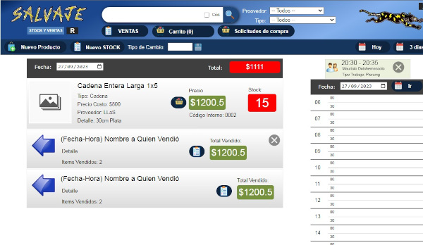
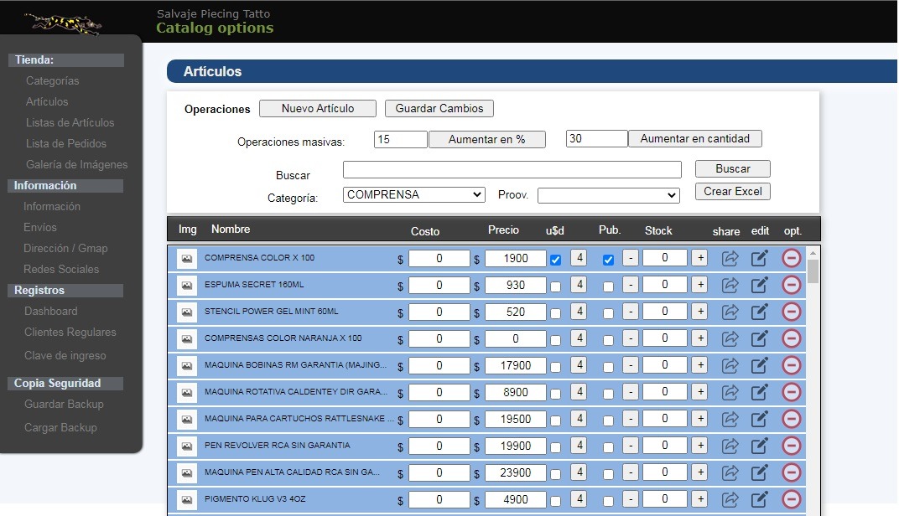
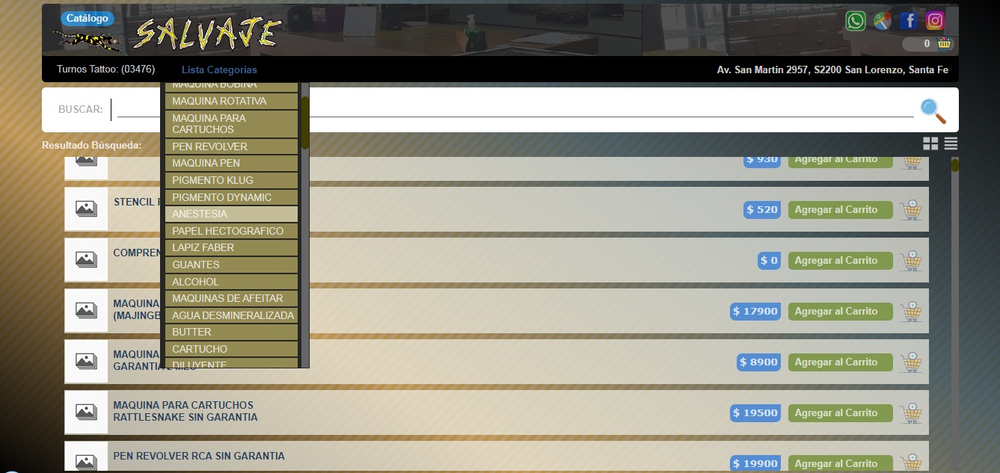

# SalvajeTiendaStock

v1.0 -> Proyecto en JavaScript (Electron) y PHP (API) de TiendaStock para tienda de venta de artículos.   
----
  
  Features:  
    + Registro de Artículos (Nombre, Costo, Precios, detalle, Proveedor y Tipo).    
    + Generador automático de código de producto.  
    + Buscador por Tipo, Proveedor o Tag en título.  
      + Galería de imágenes.  
        + Multiplicador tipo de cambio (valor dolar x costo en usd).  
        + Control de Stock por registro de ingresos y ventas.  
        + Carrito de compra in-site.  
        + Registro de ventas (con descuento en Stock).  
        + Envío de fotos.  
        + Entorno Responsive.  
        + API en php (Servidor).  
        + Control de turnos con visualizador.
        + Información persistente en formato JSON.
  
 Requisitos de instalación:  
        + Servidor LAMP con PHP 7.5 ++  
        + pc en tienda con 2GB ram, 200mb HDD, Windows 32/64 bit (Electron)  
  
 Resources:   
       - numeral.js  
       - OpenElement Environment  
       - Json   
       
 Archivos JS:  
      - [articulos.js](./v10/OpenElement%20Proyect/articulos.js) -> control de busqueda de Artículos.   
      - [botones.js](./v10/OpenElement%20Proyect/articulos.js) -> control botones web de OpenElements.  
      - [carrito.js](./v10/OpenElement%20Proyect/carrito.js) -> control de carrito de compras.  
      - [data.js](./v10/OpenElement%20Proyect/data.js) -> manejo de archivo de Datos en (Json).  
      - [fotos.js](./v10/OpenElement%20Proyect/fotos.js) -> control de subida, bajada de fotos.  
      - [funciones.js](./v10/OpenElement%20Proyect/funciones.js) -> control general de functions.  
      - [items.js](./v10/OpenElement%20Proyect/items.js).js -> variables de visualización de items (listas).  
      - [stock.js](./v10/OpenElement%20Proyect/stock.js)stock.js -> control de stock.  
      - [turnos.js](./v10/OpenElement%20Proyect/turnos.js) -> control de turnos y renderizado.  
      - [ventas.js](./v10/OpenElement%20Proyect/ventas.js) -> ventas.js -> control de ventas.  
        
  Archivos PHP:  
      - [api.php](./v10/serv/api.php) -> I/O File Json (persistent information)  
  
  Archivos Json:  
      - [articulos.json](./v10/serv/api.php) -> lista de articulos.  
      - [conf.json](./v10/serv/conf.json) -> opciones persistentes.  
      - [turnos.json](./v10/serv/turnos.json) -> lista de turnos.  
      - [ventas.json](./v10/serv/ventas.json) -> lista de ventas.  
    
v2.0 -> Proyecto en JavaScript Web Responsive y PHP (API) de TiendaStock para tienda de venta de artículos,   
----  

  

  Features:   
        + Entrono completamente Web (web tienda / web administración)    
        + Administador de Acceso vía web.    
        + Página de tienda con artículos (e-commerce) con buscador.    
        + URL shareable (Busqueda, Lista de articulos y Categoria compartible por URL).    
        + Facebook, Twitter URI shared (meta-tags para redes sociales).    
        + Registro de Artículos (Nombre, Costo, Precios, detalle, Categorías).    
        + Generador automático de código de producto.    
        + Buscador por Tipo, Proveedor o Tag en título (web / administador)    
        + Galería de imágenes múltiple.    
        + Multiplicador tipo de cambio (valor dolar x costo en usd).  
        + Cambiador de precios masivo (aumentos por % / monto ).  
        + Control de Stock por numeración en Artículo.  
        + Carrito de compra in-site.  
        + Listas de Artículos.  
        + Lista de Categorias.  
        + Graficos de Registros.  
        + Registro de ventas (con descuento en Stock).  
        + Envío de fotos.  
        + Entorno Responsive.  
        + API en php (Servidor).  
        + Información persistente en formato JSON.  
  
Requisitos de instalación:  
        + Servidor LAMP con PHP 7.5 ++  

  
Resources:   
       - numeral.js  
       - OpenElement Environment  
       - Json   
  
       

       
